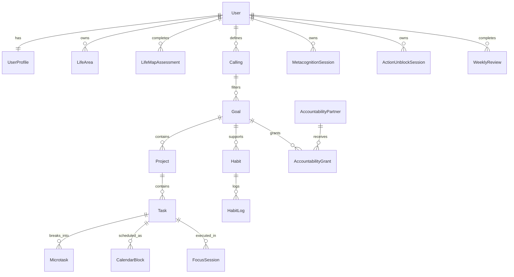

# Domain Model

## Principios

- `User` e a raiz de propriedade dos dados.
- `Calling` filtra `Goal`, `Project`, `Task`, `Habit`, `CalendarBlock` e Revisao.
- `AccountabilityGrant` limita Atalaia por alvo.
- `MetacognitionSession` e privada por padrao.
- `GardenState` e derivado, nao fonte primaria.
- Entidades candidatas a Supabase devem prever RLS por usuario e escopo.

## Entidades principais

| Entidade | Campos conceituais | Relacoes |
|---|---|---|
| User | id, name, email, timezone, faith_mode, ai_tone_preference, onboarding_status | Raiz; mapeavel a auth futura |
| UserProfile | user_id, occupation, routine_summary, focus_challenges, energy_pattern, responsibilities, family_context, faith_context, support_preference | 1:1 User |
| LifeArea | id, user_id, slug, name, current_score, color, icon | N:1 User |
| LifeMapAssessment | id, user_id, date, area_scores, answers, ai_summary | N:1 User |
| Calling | id, user_id, status, statement, hypothesis, values, burdens, gifts, people_to_serve, contribution | N:1 User |
| Goal | id, user_id, calling_id, life_area_id, title, SMART-E fields, ecological_analysis, status, deadline | N:1 User/Calling/LifeArea |
| Project | id, user_id, goal_id, title, description, phase, status, risks, resources | N:1 Goal |
| Task | id, user_id, project_id, goal_id, title, description, type, status, energy_level, estimated_minutes, due_date, scheduled_start, scheduled_end, next_action | N:1 Project/Goal |
| Microtask | id, user_id, task_id, title, order, status | N:1 Task |
| CalendarBlock | id, user_id, task_id, habit_id, type, start_time, end_time, status, energy_level, recurrence_rule | N:1 User; opcional Task/Habit |
| InboxItem | id, user_id, content, content_type, classification, recommended_action, confidence, status, destination_type, destination_id | N:1 User |
| FocusSession | id, user_id, task_id, duration_minutes, started_at, ended_at, status, distractions_captured | N:1 User/Task |
| Habit | id, user_id, goal_id, title, identity, trigger, minimum_version, ideal_version, reward, frequency, metric, status | N:1 User/Goal |
| HabitLog | id, user_id, habit_id, date, status, notes | N:1 Habit |
| DisciplineScoreboard | id, user_id, title, period, items, visibility | N:1 User |
| ScoreboardEntry | id, user_id, scoreboard_id, date, item_type, item_id, value, note | N:1 Scoreboard |
| MetacognitionSession | id, user_id, related_task_id, related_goal_id, related_project_id, emotional_state, intensity, raw_thought, fact, interpretation, feeling, impulse, cognitive_patterns, ai_reframe, confrontation_question, next_action, privacy_level | N:1 User; opcional Task/Goal/Project |
| ActionUnblockSession | id, user_id, task_id, state, energy, time_available, obstacle, ai_plan, started_focus | N:1 User/Task |
| WeeklyReview | id, user_id, week_start, week_end, answers, ai_summary, patterns, next_week_focus | N:1 User |
| AccountabilityPartner | id, user_id, partner_user_id, name, email, status | N:1 User |
| AccountabilityGrant | id, user_id, accountability_partner_id, goal_id, permissions, accepted_at, revoked_at | N:1 Partner/Goal |
| CommitmentDocument | id, user_id, goal_id, content, status, version, shared_with_atalaias | N:1 Goal |
| GardenState | id, user_id, area_states, unlocked_items, updated_at | 1:1/N User snapshot |
| ConsentRecord | id, user_id, consent_type, version, scope, subject_type, subject_id, accepted_at, revoked_at | N:1 User |

## Relacionamentos principais

## Eventos do dominio

- `profile.updated`
- `consent.accepted`
- `consent.revoked`
- `life_map.completed`
- `calling.hypothesis_created`
- `goal.activated`
- `project.created`
- `task.decomposed`
- `task.scheduled`
- `task.stuck`
- `focus.started`
- `focus.completed`
- `habit.logged`
- `habit.restarted`
- `metacognition.completed`
- `action_unblock.completed`
- `weekly_review.completed`
- `accountability_grant.created`
- `accountability_grant.revoked`
- `atalaias_message.previewed`
- `commitment_document.shared`
- `garden.updated`

## Estados principais

### Usuario

- Sem direcao.
- Direcao em construcao.
- Com alvo vago.
- Com projeto sem proxima acao.
- Tarefa grande demais.
- Travado emocionalmente.
- Baixa energia.
- Em foco.
- Retomada.
- Revisao.
- Sobrecarga.

### Goal

- draft
- active
- paused
- completed
- abandoned
- needs_review

### Project

- draft
- active
- paused
- completed
- archived
- needs_review

### Task

- pending
- scheduled
- in_focus
- completed
- deferred
- stuck
- cancelled

### CalendarBlock

- scheduled
- completed
- cancelled

### InboxItem

- unprocessed
- processed
- archived
- discarded

### AccountabilityGrant

- invited
- active
- revoked
- expired

## Permissoes

- Dono acessa seus dados por `user_id`.
- Atalaia acessa somente dados de `Goal` autorizado por `AccountabilityGrant` ativo.
- Atalaia nao acessa Chamado completo, Metacognicao, saude, familia, financas, emocoes, revisoes privadas ou inbox bruto por padrao.
- IA processa dados no backend e com minimizacao.
- Dados compartilhaveis precisam de escopo, consentimento e previa.

## Dados privados

- Metacognicao.
- Chamado completo.
- Contexto de fe.
- Saude/energia/sono.
- Familia.
- Financas.
- Emocoes.
- Revisao semanal.
- Inbox bruto.
- Calendario completo.

## Dados compartilhaveis com Atalaia

Somente por alvo e consentimento:

- Status do alvo.
- Progresso.
- Marcos.
- Atraso autorizado.
- Pedido de ajuda.
- Resumo limitado do Placar.
- Documento de compromisso, se escolhido.

## Entidades candidatas para Supabase

Todas as entidades listadas sao candidatas futuras. Para simplificar RLS, tabelas filhas devem ter `user_id` quando possivel, mesmo quando a relacao permitir inferir dono por join.

## Riscos de modelagem

- Campos polimorficos (`destination_type`, `destination_id`, `item_id`) exigem validacao server-side.
- JSON flexivel em `permissions`, `items`, `patterns` e `area_states` facilita V1, mas pode dificultar auditoria.
- Atalaia por e-mail sem identidade autenticada exige link expiravel e auditavel.
- Jardim deve continuar derivado para evitar inconsistencias.
- Recorrencia de calendario permanece simples na V1; expansoes exigem decisao de timezone e serie recorrente.
- Classificacao de inbox nao deve substituir decisao do usuario; sempre manter revisao/edicao antes do destino final quando houver impacto operacional.
