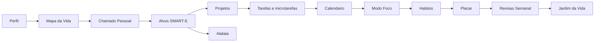
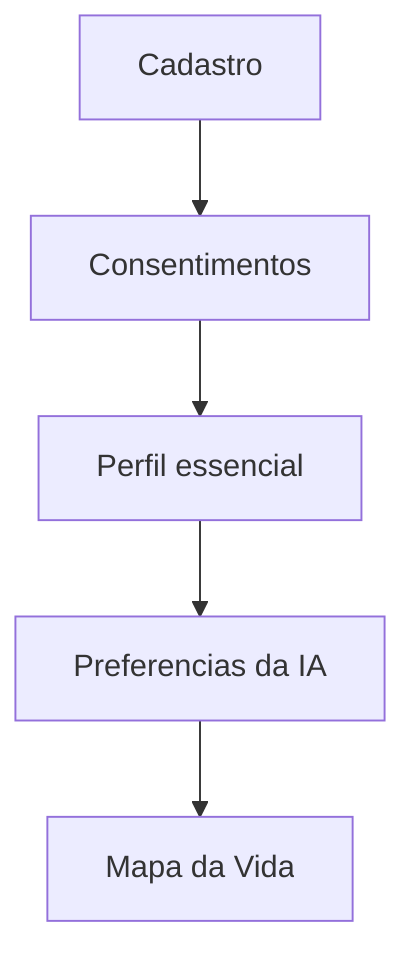
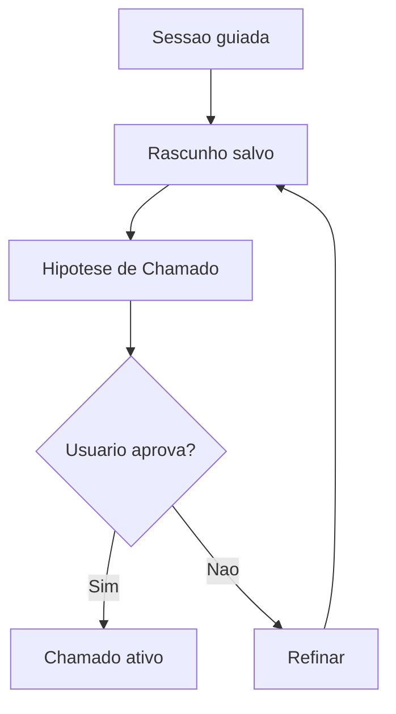
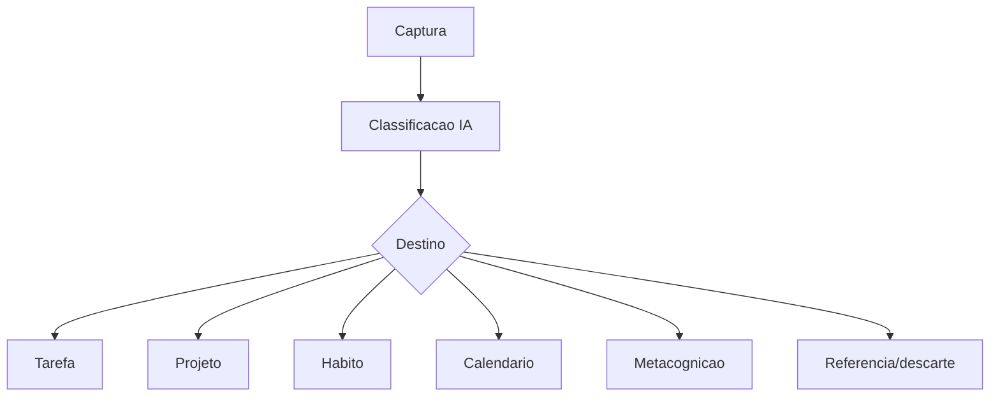
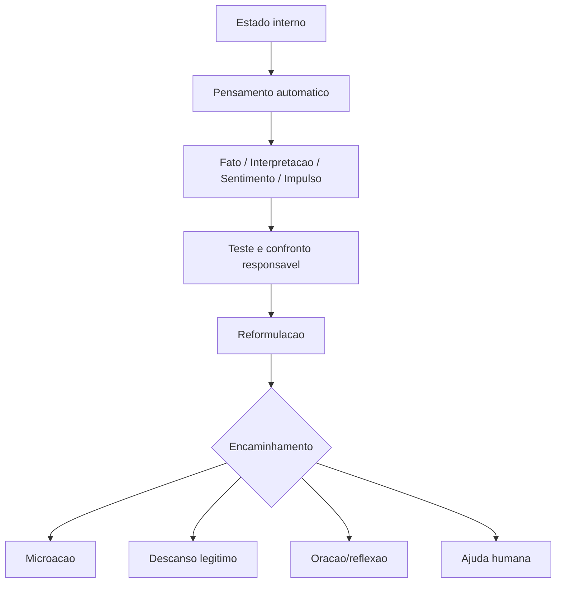
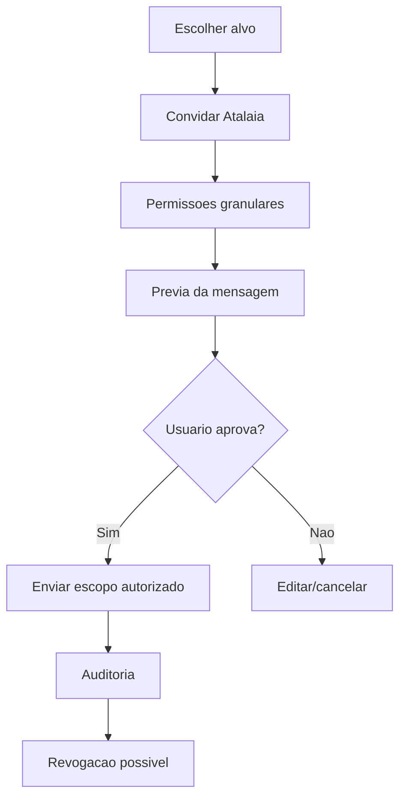

# User Flows

## Jornada macro

## Cadastro e perfil

1. Usuario cria conta.
2. Aceita termos e consentimentos essenciais.
3. Informa perfil minimo.
4. Configura tom da IA e camada crista.
5. Vai para Mapa da Vida ou dashboard de onboarding.

## Mapa da Vida

1. Usuario avalia areas.
2. Responde perguntas curtas.
3. Recebe leitura visual.
4. IA sugere areas fortes, frageis e desequilibrios.
5. Historico e salvo.

## Chamado Pessoal

1. Usuario inicia sessao guiada.
2. IA pergunta sobre dores, dons, valores, servico, experiencias e responsabilidades.
3. Sistema salva rascunho.
4. Usuario recebe hipotese de Chamado.
5. Hipotese vira filtro de alvos.

## Criacao de alvo

1. Usuario escreve desejo vago.
2. IA transforma em SMART-E.
3. Sistema verifica ecologia e alinhamento ao Chamado.
4. Usuario edita e aprova.
5. Alvo recebe primeira acao.

## Geracao de projeto

1. Usuario seleciona alvo.
2. IA sugere projeto, fases e marcos.
3. Usuario edita.
4. Sistema cria tarefas iniciais.
5. Projeto entra em acompanhamento.

## Criacao e quebra de tarefa

1. Usuario cria tarefa ou aceita tarefa sugerida.
2. Se tarefa for grande, IA sugere microtarefas.
3. Usuario define energia, tempo e prazo.
4. Sistema destaca proxima acao.
5. Usuario agenda ou inicia foco.

## Agendamento no calendario

1. Usuario escolhe tarefa, habito ou foco.
2. Sistema sugere blocos possiveis.
3. Usuario confirma horario.
4. Calendario verifica sobrecarga.
5. Bloco fica visivel na semana/dia.

## Captura na inbox

1. Usuario captura texto rapido.
2. IA classifica.
3. Usuario confirma destino.
4. Item vira tarefa, projeto, habito, evento, referencia, Metacognicao ou descarte.

## Desbloqueador de Acao

1. Usuario informa o que tentou fazer.
2. Informa obstaculo, energia e tempo.
3. IA gera primeiro passo.
4. Se bloqueio for emocional/cognitivo, encaminha para Metacognicao.
5. Usuario inicia foco ou salva microacao.

## Metacognicao

1. Usuario registra estado, intensidade e pensamento.
2. IA separa fato, interpretacao, sentimento e impulso.
3. IA identifica pensamento automatico e distorcoes provaveis.
4. IA confronta com responsabilidade sem humilhar.
5. IA reformula e sugere microacao, descanso, oracao/reflexao ou ajuda humana.
6. Sessao e privada por padrao.

## Modo Foco

1. Usuario escolhe tarefa/microtarefa.
2. Define duracao.
3. Inicia foco.
4. Captura distracoes sem sair do fluxo.
5. Conclui, pausa ou retoma.
6. Sistema atualiza progresso.

## Habito

1. Usuario descreve habito desejado.
2. IA propõe gatilho, minimo, ideal, recompensa e plano se/entao.
3. Usuario agenda ou vincula ao Placar.
4. Usuario marca execucao.
5. Falha gera modo recomeco.

## Placar

1. Usuario seleciona itens-chave.
2. Marca execucao com baixo atrito.
3. Sistema valoriza retomadas.
4. Resumo alimenta Revisao Semanal e, se autorizado, Atalaia.

## Revisao semanal

1. Usuario responde perguntas sobre semana.
2. Sistema agrega tarefas, foco, habitos, Placar e padroes.
3. IA gera sintese.
4. Usuario define foco da proxima semana.
5. Jardim e atualizado.

## Atalaia

1. Usuario escolhe um alvo.
2. Convida Atalaia.
3. Define permissoes granulares.
4. Sistema gera previa de mensagem.
5. Usuario aprova envio.
6. Atalaia recebe apenas escopo autorizado.
7. Usuario pode revogar.

## Jardim da Vida

1. Sistema le progresso por areas.
2. Atualiza estado visual.
3. Areas negligenciadas aparecem como convite de cuidado.
4. Revisao semanal sugere ajuste.

## PWA/mobile

1. Usuario abre rapidamente.
2. Escolhe captura, habito, Placar, foco curto, Desbloqueador, Metacognicao rapida ou energia.
3. Registra em poucos toques.
4. Sincroniza com desktop.
