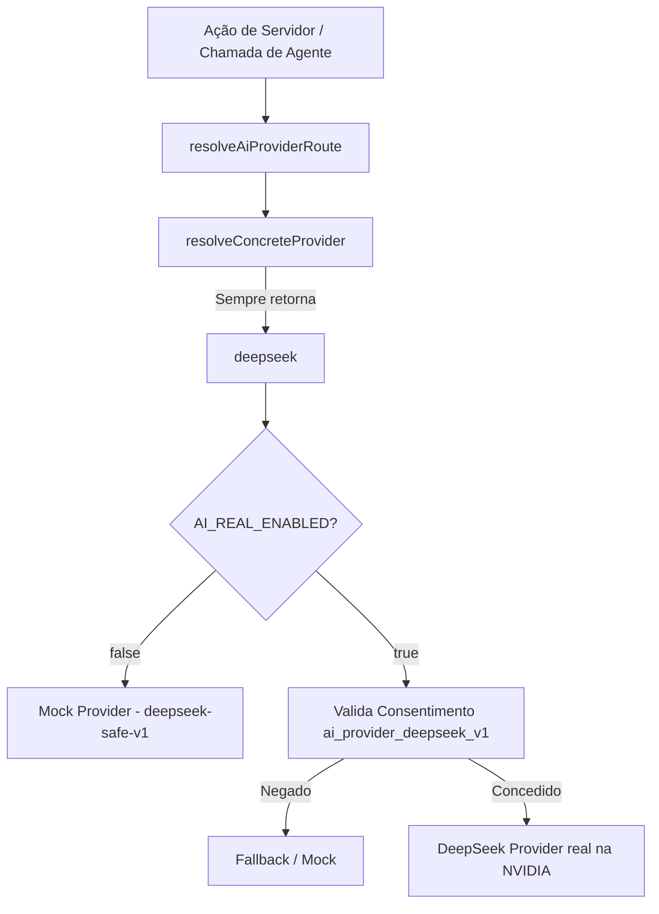

# Design Spec: Unificação da IA sob o DeepSeek V4 Pro

Este documento especifica o design para a unificação da camada de IA do projeto **Propósito em Ação** sob o modelo **DeepSeek V4 Pro** (hospedado na NVIDIA Integrate API), desativando em runtime e ocultando na interface do usuário as referências ao provedor OpenAI/GPT.

---

## 1. Objetivos e Requisitos

- **Modelo Único**: O projeto utilizará exclusivamente o modelo `deepseek-ai/deepseek-v4-pro` para todas as tarefas de texto, raciocínio e visão/imagem-para-texto.
- **Simplificação de Runtime**:
  - O roteador de IA deve sempre selecionar o provedor `deepseek` em runtime.
  - O provedor `openai` (GPT) deve ser completamente contornado, mantendo seus arquivos de suporte físico no repositório apenas para garantir que não haja erros de compilação.
- **Simplificação da Interface (UI)**:
  - O card de consentimento da OpenAI e a opção de preferência da OpenAI devem ser removidos da tela de configurações (`SettingsCenter.tsx`).
  - O consentimento do DeepSeek será o único necessário para ativar as chamadas de IA.

---

## 2. Arquitetura e Fluxo de Dados

---

## 3. Detalhamento Técnico das Modificações

### 3.1. Roteamento de IA (`src/lib/ai/routing.ts`)
- Modificar a função `resolveConcreteProvider` para sempre retornar `"deepseek"`.
- Desviar a preferência explícita `"openai"` para `"deepseek"`.
- Remover a distinção de agentes sensíveis que eram direcionados para a OpenAI.

### 3.2. Esquema de Configurações (`src/lib/config/env.ts`)
- Alterar o valor default de `DEEPSEEK_MODEL_FLASH` de `"deepseek-chat"` para `"deepseek-ai/deepseek-v4-pro"`.
- Alterar o valor default de `DEEPSEEK_MODEL_PRO` de `"deepseek-reasoner"` para `"deepseek-ai/deepseek-v4-pro"`.

### 3.3. Configurações da Interface (`src/components/settings/SettingsCenter.tsx`)
- Atualizar a constante `providerOptions` para remover o item com valor `"openai"`.
- Modificar o mapeador de consentimento no componente para renderizar apenas o card do provedor `deepseek`, ocultando o card `openai`.
- Atualizar as descrições e textos da tela de configurações para mencionar o uso exclusivo do modelo DeepSeek V4 Pro.

---

## 4. Plano de Verificação

### Testes Automatizados
- Atualizar a suíte de testes unitários do roteador `src/tests/unit/ai-provider-routing.test.ts` para refletir que qualquer preferência e nível de agente agora roteiam estritamente para `deepseek`.
- Executar `npm.cmd run typecheck` e `npm.cmd run lint`.
- Executar a suíte de testes do projeto: `npm.cmd run test`.

### Verificação Manual
- Validar a tela de configurações localmente no navegador, garantindo que o seletor da OpenAI e seu card de consentimento foram totalmente removidos.
